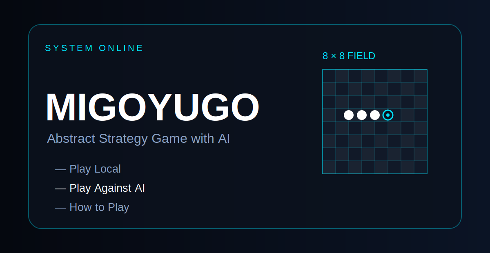
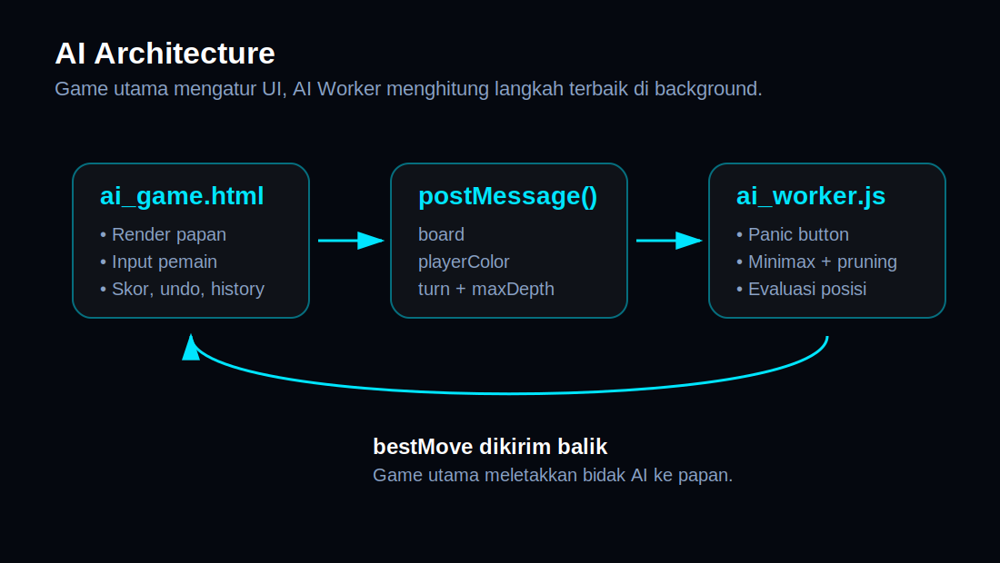
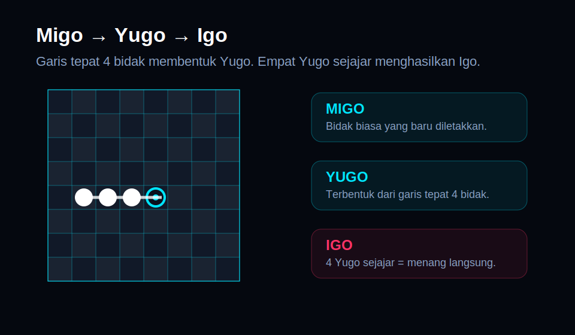
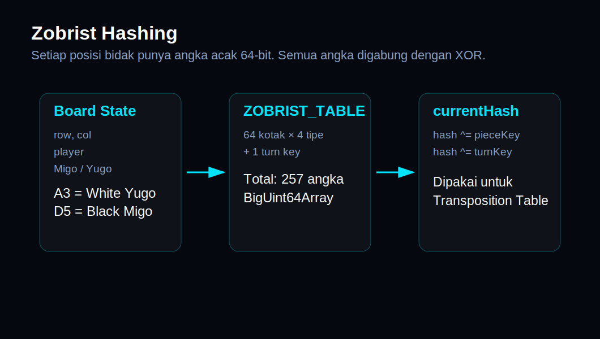
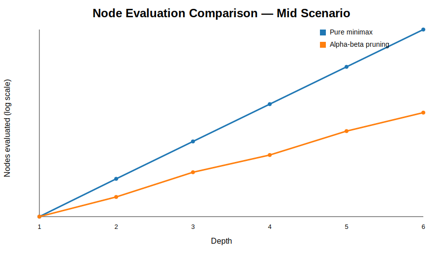
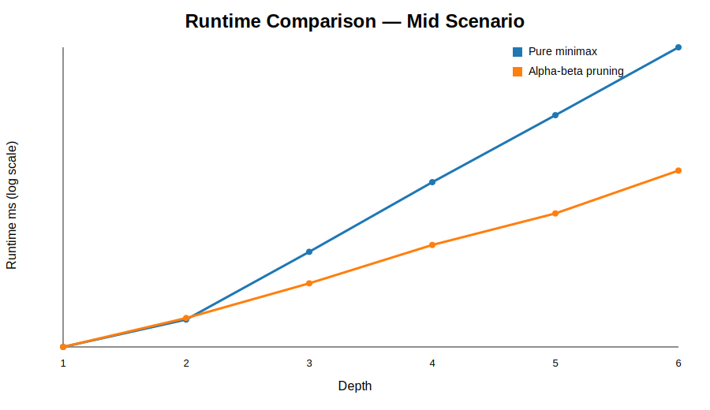
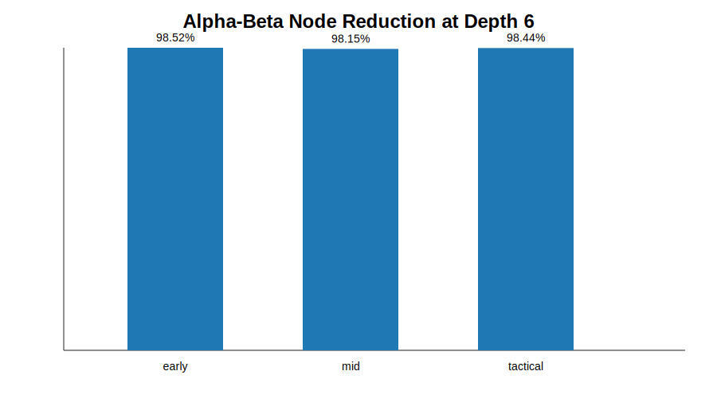

# Laporan Komprehensif Project Migoyugo AI



## 1. Ringkasan Project

Migoyugo adalah game strategi abstrak berbasis web dengan papan **8 × 8**. Pemain meletakkan bidak **Migo**, membentuk **Yugo**, lalu berusaha membuat **Igo**, yaitu empat Yugo dalam satu garis. Project ini memiliki halaman menu utama, halaman aturan, dan mode melawan AI.

Secara arsitektur, project dibagi menjadi dua komponen utama:

1. **Game utama** di `ai_game.html`, yang menangani UI, papan, klik pemain, skor, history, undo, resign, dan komunikasi dengan AI.
2. **AI Worker** di `ai_worker.js`, yang menangani pencarian langkah terbaik menggunakan minimax, alpha-beta pruning, iterative deepening, transposition table, dan heuristik evaluasi.



## 2. Analisis Aturan Game



### Migo

```javascript
{ player: p, yugo: false }
```

Migo adalah bidak biasa yang diletakkan pemain.

### Yugo

```javascript
{ player: p, yugo: true }
```

Yugo terbentuk ketika pemain membuat garis tepat empat bidak.

### Igo

Igo adalah kondisi menang langsung ketika pemain memiliki empat Yugo dalam garis horizontal, vertikal, atau diagonal.

## 3. Cara Kerja AI

### Legal Move Generation

```javascript
if (!board[r][c] && !wouldCreateLongLineOnBoard(board, r, c, turn)) {
  legalMoves.push({ row: r, col: c });
}
```

AI hanya mempertimbangkan kotak kosong yang tidak melanggar aturan garis panjang.

### Panic Button

```javascript
const myIgoWins = getIgoThreatCells(board, turn);

if (myIgoWins.length > 0) {
  self.postMessage({ bestMove: myIgoWins[0], bestScore: 99999 });
  return;
}
```

Jika AI bisa menang langsung, AI tidak perlu menjalankan pencarian panjang.

### Minimax dan Alpha-Beta

```javascript
if (beta <= alpha) break;
```

Alpha-beta pruning memangkas cabang yang tidak perlu dihitung.

### Iterative Deepening

```javascript
for (let currentDepth = 1; currentDepth <= searchMaxDepth; currentDepth++) {
  // pencarian bertahap
}
```

AI mencari dari depth kecil ke besar agar selalu memiliki hasil terbaik sementara.

## 4. Zobrist Hashing dan Transposition Table



```javascript
const ZOBRIST_TABLE = new BigUint64Array(257);
crypto.getRandomValues(ZOBRIST_TABLE);
```

Ukuran `257` berasal dari:

```text
64 kotak × 4 tipe bidak = 256
+ 1 turn key = 257
```

Hash dipakai sebagai identitas posisi papan. Hasil pencarian disimpan dalam transposition table agar posisi yang sama tidak dihitung ulang.

## 5. Benchmark: Minimax Murni vs Alpha-Beta Pruning

### Metodologi

Benchmark ini dibuat sebagai dokumentasi performa dengan replikasi logika pencarian. Benchmark menggunakan:

- Papan 8 × 8.
- Skenario `early`, `mid`, dan `tactical`.
- Depth 1 sampai 6.
- Candidate limit = `6`.
- Evaluasi posisi ringan berbasis heatmap.
- Perbandingan pure minimax vs alpha-beta pruning.

> Catatan: angka ini bukan klaim performa final browser. Untuk angka final, instrumentasikan langsung `ai_worker.js`.

### Log Benchmark

| scenario | depth | candidate_limit | pure_minimax_nodes | alpha_beta_nodes | node_reduction_percent | pure_minimax_ms | alpha_beta_ms | speedup_x_by_nodes |
| --- | --- | --- | --- | --- | --- | --- | --- | --- |
| early | 1 | 6 | 7 | 7 | 0.0 | 0.447 | 0.346 | 1.0 |
| early | 2 | 6 | 43 | 18 | 58.14 | 2.123 | 1.97 | 2.39 |
| early | 3 | 6 | 259 | 59 | 77.22 | 13.471 | 5.031 | 4.39 |
| early | 4 | 6 | 1555 | 130 | 91.64 | 79.83 | 15.884 | 11.96 |
| early | 5 | 6 | 9331 | 381 | 95.92 | 461.114 | 35.915 | 24.49 |
| early | 6 | 6 | 55987 | 827 | 98.52 | 2780.539 | 107.551 | 67.7 |
| mid | 1 | 6 | 7 | 7 | 0.0 | 0.477 | 0.288 | 1.0 |
| mid | 2 | 6 | 43 | 18 | 58.14 | 2.049 | 2.132 | 2.39 |
| mid | 3 | 6 | 259 | 59 | 77.22 | 12.089 | 5.293 | 4.39 |
| mid | 4 | 6 | 1555 | 135 | 91.32 | 74.967 | 14.472 | 11.52 |
| mid | 5 | 6 | 9331 | 426 | 95.43 | 433.75 | 33.057 | 21.9 |
| mid | 6 | 6 | 55987 | 1035 | 98.15 | 2567.435 | 101.591 | 54.09 |
| tactical | 1 | 6 | 7 | 7 | 0.0 | 0.344 | 0.297 | 1.0 |
| tactical | 2 | 6 | 43 | 18 | 58.14 | 2.132 | 1.899 | 2.39 |
| tactical | 3 | 6 | 259 | 59 | 77.22 | 12.844 | 4.958 | 4.39 |
| tactical | 4 | 6 | 1555 | 131 | 91.58 | 74.022 | 15.888 | 11.87 |
| tactical | 5 | 6 | 9331 | 393 | 95.79 | 432.328 | 36.2 | 23.74 |
| tactical | 6 | 6 | 55987 | 875 | 98.44 | 2592.951 | 99.636 | 63.99 |

### Grafik Jumlah Node



### Grafik Runtime



### Reduksi Node Depth 6



## 6. Analisis Kelebihan dan Kelemahan Heuristik

### Yugo Economy

```javascript
totalScore += myYugos * 10000;
totalScore -= oppYugos * 12000;
```

**Kelebihan:** AI memahami bahwa Yugo adalah aset utama.  
**Kelemahan:** Bobot besar bisa membuat AI terlalu fokus pada jumlah Yugo.

### Igo Threat

```javascript
totalScore += myIgoThreats * 100000;
totalScore -= oppIgoThreats * 200000;
```

**Kelebihan:** AI kuat dalam menang langsung dan memblokir ancaman.  
**Kelemahan:** AI bisa terlalu defensif karena penalti lawan sangat besar.

### Critical Cells

**Kelebihan:** Mengurangi branching factor dan membuat AI lebih taktis.  
**Kelemahan:** Bisa melewatkan langkah strategis jangka panjang.

### Pattern Scanner

**Kelebihan:** Cepat karena memakai angka, bukan string pattern.  
**Kelemahan:** Banyak aturan manual membuat tuning bobot menjadi kompleks.

### Heatmap

**Kelebihan:** AI cenderung menguasai tengah papan.  
**Kelemahan:** Heatmap statis tidak selalu cocok untuk semua posisi.

## 7. Kelebihan Sistem AI

1. UI tetap responsif karena AI memakai Web Worker.
2. AI memiliki panic button untuk menang/blokir cepat.
3. Alpha-beta pruning mengurangi node pencarian.
4. Iterative deepening membuat hasil pencarian lebih stabil.
5. Zobrist hashing membantu mengenali posisi yang sudah dihitung.
6. Heuristik cukup kaya karena memadukan Yugo, Igo threat, pola, dan heatmap.

## 8. Kelemahan Sistem AI

1. Bobot heuristik masih manual.
2. AI bisa terlalu defensif.
3. Critical filtering bisa melewatkan strategi jangka panjang.
4. Transposition table tetap memiliki risiko collision.
5. Depth tinggi masih berat pada posisi papan yang terbuka.
6. Evaluasi belum adaptif terhadap gaya bermain pemain.

## 9. Rekomendasi Pengembangan

### Tambahkan Instrumentasi Langsung

```javascript
self.postMessage({
  bestMove: globalBestMove,
  bestScore: globalBestScore,
  nodesEvaluatedTotal,
  depthReached,
  elapsedMs,
});
```

### Buat Mode Difficulty

| Difficulty | Depth | Time Limit |
|---|---:|---:|
| Easy | 1–2 | 300 ms |
| Normal | 3–4 | 600 ms |
| Hard | 5–6 | 1200 ms |

### Jadikan Bobot Heuristik Lebih Mudah Diatur

```javascript
const WEIGHTS = {
  myYugo: 10000,
  oppYugo: 12000,
  myIgoThreat: 100000,
  oppIgoThreat: 200000,
  openTwo: 1500,
};
```

## 10. Kesimpulan

Project Migoyugo sudah memiliki struktur yang kuat untuk game strategi berbasis web. Pemisahan UI dan AI melalui Web Worker adalah keputusan tepat. Dari sisi AI, penggunaan minimax, alpha-beta pruning, iterative deepening, Zobrist hashing, dan transposition table menunjukkan bahwa sistem sudah memakai teknik optimasi yang serius.

Kualitas AI masih sangat bergantung pada heuristik. Karena bobot heuristik masih manual, perlu dilakukan benchmark dan tuning lanjutan agar AI tidak terlalu defensif dan mampu membaca strategi jangka panjang dengan lebih baik.
